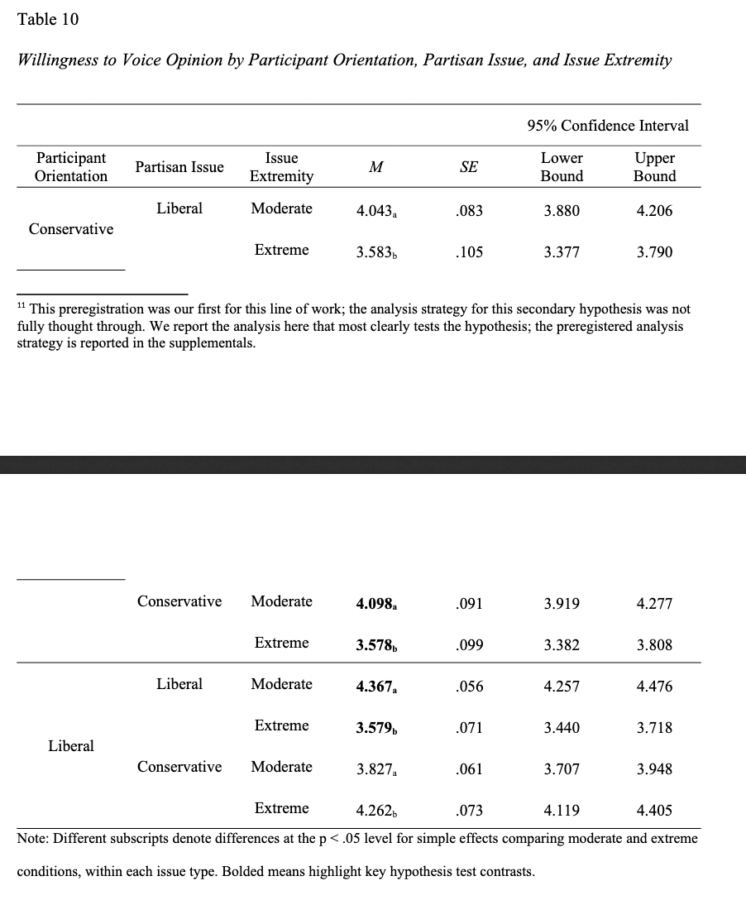

```{r, include = F}

library(groundhog)
pkgs <- c("dplyr", "readr", "reshape", "magrittr", "tidyr", "ggplot2", "psych", "haven", "Hmisc")
groundhog.library(pkgs, "2022-11-02")

options(dplyr.summarise.inform = FALSE)

colors <- c("darkgreen", "purple")


```

# Lees & Cikara, 2020, Experiment 4

Links:
* Data Availability: [OSF](https://osf.io/zhysa/)

```{r Lees & Cikara Cleaning, include = F}

# This code is mostly copied, with slight modifications, from Lees & Cikara's OSF webpage
# Copyright (c) 2019 Jeffrey Lees
# This file is covered under the The MIT License (MIT)
# In short, you are free (and encouraged to) to use, copy and distribute this file as you'd like

#### ==== Data Setup ==== 

Data_E4 <- read.csv("data/Experiment 4 Data.csv", header = TRUE)

Data_E4_Long <- melt(Data_E4, id.vars = c("ID", "Gender","Age","Condition", "Party", "Comp", "Comprehend", 
                                          "Comment", "Ethnicity", "Income", "Education", "Gender_4_TEXT"), na.rm = T)

# Below creates a column denoting the DVs: Disliking, Opposition, and Unacceptability
Data_E4_Long$DV <-
  ifelse(Data_E4_Long$variable %in% c("Sup_MP1_1","Sup_MP2_1","Sup_MP3_1","Sup_MP4_1","Sup_MP5_1","Sup_OG1_1",
    "Sup_OG2_1","Sup_OG3_1","Sup_OG4_1","Sup_OG5_1", "Sup_IP1_1","Sup_IP2_1","Sup_IP3_1","Sup_IP4_1",
    "Sup_IP5_1"), "Opposition",
  ifelse(Data_E4_Long$variable %in% c("Jus_MP1_1","Jus_MP2_1","Jus_MP3_1","Jus_MP4_1","Jus_MP5_1","Jus_OG1_1",
    "Jus_OG2_1","Jus_OG3_1","Jus_OG4_1","Jus_OG5_1", "Jus_IP1_1","Jus_IP2_1","Jus_IP3_1","Jus_IP4_1",
    "Jus_IP5_1"), "Unacceptable",
  ifelse(Data_E4_Long$variable %in% c("Like_MP1_1","Like_MP2_1","Like_MP3_1","Like_MP4_1","Like_MP5_1",
    "Like_OG1_1","Like_OG2_1","Like_OG3_1","Like_OG4_1","Like_OG5_1","Like_IP1_1","Like_IP2_1",
    "Like_IP3_1","Like_IP4_1","Like_IP5_1"), "Disliking",NA)))
Data_E4_Long$DV <- as.factor(Data_E4_Long$DV)
levels(Data_E4_Long$DV)
summary(Data_E4_Long$DV)

# Below creates a column denoting Scenario number (1-5)
Data_E4_Long$Scenario <- 
  ifelse(Data_E4_Long$variable %in% c("Sup_MP1_1","Like_MP1_1","Jus_MP1_1","Sup_OG1_1","Like_OG1_1","Jus_OG1_1",
    "Sup_IP1_1","Like_IP1_1","Jus_IP1_1"), "Scenario 1",
  ifelse(Data_E4_Long$variable %in% c("Sup_MP2_1","Like_MP2_1","Jus_MP2_1","Sup_OG2_1","Like_OG2_1","Jus_OG2_1",
    "Sup_IP2_1","Like_IP2_1","Jus_IP2_1"), "Scenario 2",
  ifelse(Data_E4_Long$variable %in% c("Sup_MP3_1","Like_MP3_1","Jus_MP3_1","Sup_OG3_1","Like_OG3_1","Jus_OG3_1",
    "Sup_IP3_1","Like_IP3_1","Jus_IP3_1"), "Scenario 3",
  ifelse(Data_E4_Long$variable %in% c("Sup_MP4_1","Like_MP4_1","Jus_MP4_1","Sup_OG4_1","Like_OG4_1","Jus_OG4_1",
    "Sup_IP4_1","Like_IP4_1","Jus_IP4_1"), "Scenario 4",
  ifelse(Data_E4_Long$variable %in% c("Sup_MP5_1","Like_MP5_1","Jus_MP5_1","Sup_OG5_1","Like_OG5_1","Jus_OG5_1",
    "Sup_IP5_1","Like_IP5_1","Jus_IP5_1"), "Scenario 5",NA)))))
Data_E4_Long$Scenario <- as.factor(Data_E4_Long$Scenario)
levels(Data_E4_Long$Scenario)
summary(Data_E4_Long$Scenario)

# Returns data to normal format 
Data_E4_Wide <- cast(Data_E4_Long[, setdiff(names(Data_E4_Long), "variable")], ... ~ DV, value = "value")


```

```{r Lees & Cikara Re-Analysis, echo = F}

#### ==== Reformatting data ==== 


data <- Data_E4_Wide
data$Condition <- as.factor(data$Condition)
levels(data$Condition) <- c("self", "ingroup", "outgroup")

dislike <- data %>% 
  filter(Condition == "ingroup" | Condition == "self") %>% 
  group_by(Party, Scenario, Condition) %>% 
  dplyr::summarize(value = mean(Disliking, na.rm=T), n = n(), sd = sd(Disliking, na.rm=T)) %>% 
  mutate(category = "dislike") %>% 
  pivot_wider(
    names_from = Condition,
    values_from = c(value, n, sd)
  )


oppose <- data %>% 
  filter(Condition == "ingroup" | Condition == "self") %>% 
  group_by(Party, Scenario, Condition) %>% 
  dplyr::summarize(value = mean(Opposition, na.rm=T), n = n(), sd = sd(Opposition, na.rm=T)) %>% 
  mutate(category = "oppose") %>% 
  pivot_wider(
    names_from = Condition,
    values_from = c(value, n, sd)
  )

unacceptable <- data %>% 
  filter(Condition == "ingroup" | Condition == "self") %>% 
  group_by(Party, Scenario, Condition) %>% 
  dplyr::summarize(value = mean(Unacceptable, na.rm=T), n = n(), sd = sd(Unacceptable, na.rm=T)) %>% 
  mutate(category = "unacceptable") %>% 
  pivot_wider(
    names_from = Condition,
    values_from = c(value, n, sd)
  )

test <- rbind(dislike, oppose, unacceptable)

#### ==== Calculating Cohen's d ==== 

cohensd <- function(mean1,std1,count1,mean2,std2,count2){
  dof = (count1 + count2 - 2)
    cohens_d = (mean1 - mean2) / sqrt(((count1 - 1) * std1 ** 2 + (count2 - 1) * std2 ** 2) / dof)
    cohens_d
}

test <- test %>% 
  mutate(d = cohensd(value_ingroup, sd_ingroup, n_ingroup, value_self, sd_self, n_self))

```

View results: 
```{r}
#### ==== Calculating effect size for various ingroup misperceptions ==== 

select(test, Party, Scenario, category, d) #view  all results

```

==== Calculating effect size for various ingroup misperceptions ==== 
```{r}

test %>% 
  group_by(Party) %>% 
  summarize(mean(d))

test %>% 
  group_by(Scenario) %>% 
  summarize(mean(d))

test %>% 
  group_by(category) %>% 
  summarize(mean(d))

alpha(na.omit(Data_E4_Wide[,c("Disliking", "Opposition", "Unacceptable")]))

## Grand mean

data_long <- Data_E4_Long
data_long$Condition <- Condition <- as.factor(data_long$Condition)
levels(data_long$Condition) <- c("self", "ingroup", "outgroup")

grand_mean_d <- data_long %>% 
  filter(Condition == "ingroup" | Condition == "self") %>% 
  group_by(Condition) %>% 
  dplyr::summarize(DV = mean(value, na.rm=T), n = n(), sd = sd(value, na.rm=T)) %>% 
  pivot_wider(
    names_from = Condition,
    values_from = c(DV, n, sd)
  ) %>% 
  mutate(d = cohensd(DV_ingroup, sd_ingroup, n_ingroup, DV_self, sd_self, n_self)) 

grand_mean_d$d
mean(test$d)


#### ==== Collapsing across 3 DVs (the least variation of categories above) ==== 


dv_collapsed <- data_long %>% 
  filter(Condition == "ingroup" | Condition == "self") %>% 
  group_by(Party, Scenario, Condition) %>% 
  dplyr::summarize(DV = mean(value, na.rm=T), n = n(), sd = sd(value, na.rm=T)) %>% 
  pivot_wider(
    names_from = Condition,
    values_from = c(DV, n, sd)
  ) %>% 
  mutate(d = cohensd(DV_ingroup, sd_ingroup, n_ingroup, DV_self, sd_self, n_self))

```

Plotting effect sizes across scenarios & party:
```{r}
library(ggplot2)
plot_data <- select(dv_collapsed, Party, Scenario, d)
plot_data$Party <- as.factor(plot_data$Party)
party_means <- plot_data %>% 
  group_by(Party) %>% 
  summarize(mean_d = mean(d))
dem_mean <- party_means$mean_d[party_means$Party == "Democrat"]
rep_mean <- party_means$mean_d[party_means$Party == "Republican"]

ggplot(data = plot_data, mapping = aes(x = Scenario, y = d)) +
  geom_point(aes(color = factor(Party))) +
  scale_color_manual(values = c("blue", "red")) +
  labs(y = "Effect Size (d)", x = "", title = "Magnitude of Ingroup Misperception") +
  theme(plot.title = element_text(hjust = 0.5)) +
  guides(color = guide_legend(title = "Party")) +
  geom_hline(yintercept=dem_mean, linetype="dashed", color = "blue") +
  geom_hline(yintercept=rep_mean, linetype="dashed", color = "red")

```

Visualizing total effect size:
```{r}

dv_collapsed_long_grandmean <- data_long %>% 
  filter(Condition == "ingroup" | Condition == "self") %>% 
  group_by(Condition) %>% 
  dplyr::summarize(DV = mean(value, na.rm=T), n = n(), sd = sd(value, na.rm=T)) %>% 
  mutate(upper = (DV + (sd/sqrt(n))), lower = (DV - (sd/sqrt(n))),
         x = "x")


ggplot(data = dv_collapsed_long_grandmean, mapping = aes(x = x, y = DV)) +
  geom_point(aes(color = factor(Condition))) +
  scale_color_manual(values = colors) +
  geom_errorbar(aes(ymin=lower,ymax=upper, color = factor(Condition)), width = .2) +
  scale_fill_manual(values = colors) +
  labs(y = "Self and Ingroup Estimates", x = "", title = "Magnitude of Ingroup Misperception") +
  coord_cartesian(ylim = c(0,100)) +
  theme(plot.title = element_text(hjust = 0.5)) +
  guides(color = guide_legend(title = "Estimate"))
  
select(dv_collapsed_long_grandmean, DV, Condition)

```

Plotting individual misperceptions across scenario and party
```{r}

dv_collapsed_long <- data_long %>% 
  filter(Condition == "ingroup" | Condition == "self") %>% 
  group_by(Party, Scenario, Condition) %>% 
  dplyr::summarize(DV = mean(value, na.rm=T), n = n(), sd = sd(value, na.rm=T))

dv_collapsed_long <- dv_collapsed_long %>% 
  mutate(upper = (DV + (sd/sqrt(n))), lower = (DV - (sd/sqrt(n))))

ggplot(data = dv_collapsed_long, mapping = aes(x = Scenario, y = DV)) +
  geom_point(aes(color = factor(Condition))) +
  scale_color_manual(values = colors) +
  geom_errorbar(aes(ymin=lower,ymax=upper, color = factor(Condition)), width = .2) +
  scale_fill_manual(values = colors) +
  facet_wrap(vars(Party)) +
  labs(y = "Self and Ingroup Estimates", x = "", title = "Magnitude of Ingroup Misperception") +
  coord_cartesian(ylim = c(0,100)) +
  theme(plot.title = element_text(hjust = 0.5)) +
  guides(color = guide_legend(title = "Estimate"))


```

Plotting distributions of ingroup perceptions vs. self-report
```{r}

## Plotting overlapping histograms 
c1 <- rgb(128,0,128, max = 255, alpha = 100, names = "drk.purple")
c2 <- rgb(0,100,0, max = 255, alpha = 100, names = "drk.green")

dIn <- density(data_long$value[data_long$Condition=="ingroup"]) 
dSelf <- density(data_long$value[data_long$Condition=="self"]) 
plot(dIn, col = c1,
     main = "Perceptions of Outgroup Negativity: \n Self-Report vs. Ingroup Perception",
     xlab = "Outgroup Negativity (combined DV)") 
polygon(dIn, col = c1)
lines(dSelf, col = c2)
polygon(dSelf, col = c2)

```

# Hartman et al., 2022, Study 4

```{r Hartman et al. Study 4}

#1 = Dem, 2 = Rep


hartman <- read_csv("data/Hartman_Study4_Data.csv")


#filtering participants
hartman <- subset(hartman, Approve == 1)

# calculate ingroup perception variables
hartman$stupid_ingroup <- rowMeans(hartman[,c("MPIO_1","MPIO_2","MPIO_3", "MPIO_4", "MPIO_5", "MPIO_6")])
hartman$evil_ingroup <- rowMeans(hartman[,c("MPIO_7","MPIO_8","MPIO_9", "MPIO_10", "MPIO_11", "MPIO_12")])


#calculate self-report estimates (how stupid and evil people actually think the outgroup is)
hartman$stupid_self <- rowMeans(hartman[,c("PPO_1","PPO_2","PPO_3", "PPO_4", "PPO_5", "PPO_6")])

hartman$evil_self <- rowMeans(hartman[,c("PPO_7","PPO_8","PPO_9", "PPO_10", "PPO_11", "PPO_12")])

hartman$Pol_Binary <- as.factor(hartman$Pol_Binary) 
levels(hartman$Pol_Binary) <- c("Democrat", "Republican")


#BETWEEN person-style analysis
test_btw <- hartman %>% 
  select(Pol_Binary, stupid_ingroup, evil_ingroup, stupid_self, evil_self) %>% 
  pivot_longer(-Pol_Binary,
               names_to = "target",
               values_to = "value") %>% 
  group_by(Pol_Binary, target) %>% 
  dplyr::summarize(mean = mean(value), sd = sd(value), n = n()
            ) %>% 
  separate(col = target, into = c("category", "group"), sep = "_") %>% 
  pivot_wider(
    names_from = group,
    values_from = c(mean,sd,n)
  )


test_btw <- test_btw %>% 
  mutate(d = cohensd(mean_ingroup, sd_ingroup, n_ingroup, mean_self, sd_self, n_self)) 

select(test_btw, Pol_Binary, category, d) # view results

##plotting cohens d from between-group analysis

  
##plotting actual values from between-group analysis (need back in long format)
plot_between <- hartman %>% 
  select(Pol_Binary, stupid_ingroup, evil_ingroup, stupid_self, evil_self) %>% 
  pivot_longer(-Pol_Binary,
               names_to = "target",
               values_to = "value") %>% 
  group_by(Pol_Binary, target) %>% 
  summarize(mean = mean(value), sd = sd(value), n = n()
            ) %>% 
  separate(col = target, into = c("category", "group"), sep = "_") %>% 
  mutate(upper = (mean + (sd/sqrt(n))), lower = (mean - (sd/sqrt(n))))
  

ggplot(data = plot_between, mapping = aes(x = category, y = mean)) +
  geom_point(aes(color = factor(group))) +
  scale_color_manual(values = colors) +
  geom_errorbar(aes(ymin=lower,ymax=upper, color = factor(group)), width = .2) +
  scale_fill_manual(values = colors) +
  facet_wrap(vars(Pol_Binary)) +
  labs(y = "Self and Ingroup Estimates", x = "", title = "Magnitude of Ingroup Misperception") +
  coord_cartesian(ylim = c(1,7)) +
  theme(plot.title = element_text(hjust = 0.5)) +
  guides(color = guide_legend(title = "Estimate"))

#overlapping histograms

c1 <- rgb(128,0,128, max = 255, alpha = 100, names = "drk.purple")
c2 <- rgb(0,100,0, max = 255, alpha = 100, names = "drk.green")

dInStupid <- density(hartman$stupid_ingroup) 
dSelfStupid <- density(hartman$stupid_self) 
plot(dInStupid, col = c1,
     main = "Perceptions of Outgroup Stupidity: \n Self-Report vs. Ingroup Perception",
     xlab = "Unintelligence of outgroup") 
polygon(dInStupid, col = c1)
lines(dSelfStupid, col = c2) 
polygon(dSelfStupid, col = c2)

dInEvil <- density(hartman$evil_ingroup)
dSelfEvil <- density(hartman$evil_self)
plot(dInEvil, col = c1,
     main = "Perceptions of Outgroup Immorality: \n Self-Report vs. Ingroup Perception",
     xlab = "Immorality of outgroup") 
polygon(dInEvil, col = c1)
lines(dSelfEvil, col = c2) 
polygon(dSelfEvil, col = c2)


#WITHIN person analysis
  
test_within <- hartman %>%
  mutate(
    stupid = stupid_ingroup - stupid_self,
    evil = evil_ingroup - evil_self
  ) %>% 
  select(Pol_Binary, stupid, evil) %>% 
  pivot_longer(-Pol_Binary,
               names_to = "category",
               values_to = "value") %>% 
  group_by(Pol_Binary, category) %>%
  dplyr::summarise(
    
    misperception = mean(value, na.rm = TRUE),
    sd = sd(value, na.rm = TRUE),
    n = sum(!is.na(value))
  )

test_within <- test_within %>% 
  mutate(d = misperception/sd)

select(test_within, Pol_Binary, category, d) # view results   


```

# Moore-Berg et al., 2020, Study 2, Wave 1
```{r Moore-Berg}

#Load data
path <- file.path("~/Documents/Grad School/projects/repos/MAPP/data", "Moore-Berg Study 2 Data.sav")
df <- read_sav(path)
df <- as.data.frame(df)
dim(df)

#filter by finishing, too?
df <- df[which(df$Finished==1 & df$Finishedp==1 & df$Check5 == 5 & df$Check5p == 5 | df$Finished==1 & df$Finishedp==1 & df$Check5.0 == 5 & df$Check5.0p == 5),]
dim(df)

#Understand Syntax
names(df)
#FT_6 is warmth toward dems
#FT_7 is warmth toward republicans
#ascent_4 = dehumanization of dems
#ascent_4 = dehumanization of reps

#Party variable
df$PARTY2[df$DemRepInd==-2 | df$DemRepInd==-1] <- -1
df$PARTY2[df$DemRepInd== 0 & df$Lean==-1] <- -1
df$PARTY2[df$DemRepInd==1 | df$DemRepInd==2] <- 1
df$PARTY2[df$DemRepInd== 0 & df$Lean==1] <- 1
 # -1 is Dem, +1 is Rep

table(df$PARTY2)

##### Wave 1 #####

#Reverse scoring variables to be consistent with authors
df$borders_truth <- 100 - df$FP_self_1
df$borders_dem <- 100 - df$FP_dem_1
df$borders_rep <- 100 - df$FP_rep_1


#Reverse scoring variables to be consistent with authors
df$gun_truth <- 100 - df$Guns_1
df$gun_dem <- 100 - df$Guns_Dems_1
df$gun_rep <- 100 - df$Guns_Rep_1

#Reverse scoring variables to be consistent with authors
df$police_truth <- 100 - df$FPPolice_1
df$police_dem <- 100 - df$FPPolice_Dem_1
df$police_rep <- 100 - df$FPPolice_Rep_1

d <- df %>% 
  pivot_longer(c(borders_truth, borders_dem, borders_rep, gun_truth, gun_dem, gun_rep, police_truth, police_dem, police_rep),
               names_to = "target",
               values_to = "support") %>% 
  select(PARTY2, target, support) %>% 
  separate(target,
           into = c("issue", "target"),
           sep = "_") %>% 
  filter((PARTY2 == 1 & target == "rep") | (PARTY2 == -1 & target == "dem") | (target == "truth")) 

d$target<-ifelse(d$target == "dem" | d$target == "rep", "ingroup", "self")

d_wide <- d %>% 
  group_by(PARTY2, issue, target) %>% 
  dplyr::summarize(mean_support = mean(support, na.rm =T),
                  sd = sd(support, na.rm = T),
                  n = n()) %>% 
  pivot_wider(
    names_from = target,
    values_from = c(mean_support, sd, n)
  )


cohensd <- function(mean1,std1,count1,mean2,std2,count2){
  dof = (count1 + count2 - 2)
    cohens_d = (mean1 - mean2) / sqrt(((count1 - 1) * std1 ** 2 + (count2 - 1) * std2 ** 2) / dof)
    cohens_d
}

test <- d_wide %>% 
  mutate(mooreberg_d = cohensd(mean_support_ingroup, sd_ingroup, n_ingroup, mean_support_self, sd_self, n_self)); test

mean(abs(test$mooreberg_d))


d_plot <- d %>% 
  group_by(PARTY2, issue, target) %>% 
  dplyr::summarize(mean = mean(support, na.rm = T),
                   sd = sd(support, na.rm = T),
                   n = n()) %>% 
  mutate(upper = (mean + (sd/sqrt(n))), lower = (mean - (sd/sqrt(n))))

colors = c("darkgreen", "purple")

ggplot(data = d_plot, mapping = aes(x = issue, y = mean)) +
  geom_point(aes(color = factor(target))) +
  scale_color_manual(values = colors) +
  geom_errorbar(aes(ymin=lower,ymax=upper, color = factor(target)), width = .2) +
  scale_fill_manual(values = colors) +
  facet_wrap(vars(PARTY2)) +
  labs(y = "Increasing Liberal Viewpoint", x = "Democrat vs. Republican", title = "Magnitude of Ingroup Misperception") +
  coord_cartesian(ylim = c(0,100)) +
  theme(plot.title = element_text(hjust = 0.5)) +
  guides(color = guide_legend(title = "Estimate"))


```


# Parker et al. (preprint), Study 1

```{r Parker study 1}

labels = c(1:8)

row1 <- c("Moderate", "Liberal", "Liberal", "self", 6.389, .123)
row2 <- c("Moderate", "Liberal", "Liberal", "ingroup", 6.080, .117)
row3 <- c("Moderate", "Conservative", "Conservative", "self", 5.939, .157)
row4 <- c("Moderate", "Conservative", "Conservative", "ingroup", 6.111, .158)
row5 <- c("Extreme", "Liberal", "Liberal", "self", 3.527, .120)
row6 <- c("Extreme", "Liberal", "Liberal", "ingroup", 4.036, .114)
row7 <- c("Extreme", "Conservative", "Conservative", "self", 2.989, .167)
row8 <- c("Extreme", "Conservative", "Conservative", "ingroup", 3.330, .168)

data <- as.data.frame(rbind(row1, row2, row3, row4, row5, row6, row7, row8), row.names = labels)
names(data) <- c("Issue_Extremity", "Issue_Orientation", "Party", "Estimation_Target", "Mean", "SE")
data$Mean <- as.numeric(data$Mean)
data$SE <- as.numeric(data$SE)
data$Estimation_Target <- as.factor(data$Estimation_Target)


plot_data <- data %>% 
  group_by(Issue_Extremity, Estimation_Target) %>% 
  dplyr::summarize(estimate = mean(Mean), se = mean(SE)) %>% 
  mutate(upper = estimate + se, lower = estimate - se); plot_data

colors <- c("darkgreen", "purple")

ggplot(data = plot_data, mapping = aes(x = Issue_Extremity, y = estimate)) +
  geom_point(aes(color = Estimation_Target)) +
  scale_color_manual(values = colors) +
  geom_errorbar(aes(ymin=lower,ymax=upper, color = Estimation_Target), width = .08) +
  scale_fill_manual(values = colors) +
  coord_cartesian(ylim = c(1,7)) +
  labs(y = "Degree of Support", x = "Issue Extremity", title = "Ingroup Misperception by Issue Extremity") +
  coord_cartesian(ylim = c(1,7)) +
  theme(plot.title = element_text(hjust = 0.5)) +
  guides(color = guide_legend(title = "Self-report vs. Ingroup Estimate"))
  

```

# Parker et al (preprint), Study 2

```{r Parker study 2}

data <- read.csv('data/Parker_etal_2022_transcribed.csv')
data[,1:4] <- lapply(data[,1:4], factor)

data_wide <- data  %>% 
  pivot_wider(names_from = Party,
              values_from = c(Self, Ingroup),
              id_cols = c(Issue, Orientation, Extremity)) %>% 
  mutate(group_diff = Self_Liberal - Self_Conservative) %>% 
  filter(Issue != "The Wall" & Issue != "Safe spaces")

ggplot(data_wide, mapping = aes(x=Extremity, y = group_diff)) +
  geom_point(aes(color=Orientation)) +
  scale_color_manual(values = c("blue", "red")) +
  coord_cartesian(ylim = c(-100,100)) +
  guides(color = guide_legend(title = "Issue Orientation")) +
  labs(y = "Actual group difference", x = "Issue Extremity", title = "Actual disagreement between liberals and conservatives")
  

data_long <- data %>% 
  pivot_longer(c(Self, Ingroup),
               names_to = "Target",
               values_to = "Estimate") %>% 
  group_by(Extremity, Party, Orientation, Target) %>% 
  dplyr::summarize(agreement = mean(Estimate)); data_long

data_long$Target <- as.factor(data_long$Target)

ggplot(data_long, aes(x=Party, y = agreement)) +
  geom_point(aes(color = Target)) + 
  scale_color_manual(values = c("purple", "darkgreen")) +
  facet_wrap(vars(Extremity, Orientation)) +
  guides(color = guide_legend(title = "Target Estimate")) +
  labs(y = "% agreement", x = "", title = "Ingroup misperception by issue type") +
  theme(plot.title = element_text(hjust = 0.5))

data %>% 
  mutate(ingroup_misperception = Ingroup - Self) %>% 
  filter(Extremity == "Extreme") %>% 
  filter(Issue != "The Wall" & Issue != "Safe spaces") %>% 
  dplyr::summarize(misperception = mean(ingroup_misperception))

mean(data$Self[data$Extremity=="Extreme" & data$Issue != "The Wall" & data$Issue != "Safe spaces"])


```


